# PLMS Business Process Blueprint

Status: working blueprint v0.4
Purpose: operating blueprint for the PLMS protection lifecycle, protection-domain SSOT, data authority, and staged implementation.

## 1. Product Boundary

PLMS manages the lifecycle, evidence, engineering context, and governance of protection settings.

PLMS is not intended to replace:

- PST or another enterprise asset register as the corporate asset source of truth.
- DIgSILENT/PowerFactory as the authoritative power-system simulation tool.
- Vendor engineering tools as the final validator for native relay setting files.
- NMM/CIM as an enterprise-wide network-model interchange standard.

PLMS still needs a protection-relevant network model. It stores or consumes the subset required to:

- identify the protected object and both ends of a circuit;
- identify local, remote, forward, and reverse bays;
- resolve line sections, transformers, busbars, and remote-bus branches;
- associate CT/VT, relay IED, firmware, and protection functions;
- select the correct network and fault-study snapshot;
- calculate, coordinate, compare, approve, issue, implement, and audit settings;
- determine which settings are affected by an engineering change.

The internal network graph is therefore a bounded PLMS domain model and working projection, not a replacement for the complete corporate network model.

### 1.1 Current Delivery Focus

The current operational target is **case-scoped targeted recalculation for line protection**, not unrestricted setting design from zero.

- in scope: Distance core, residual compensation, resistive reach, load blinder/power swing, line differential, AR policy review, and remote coordination impact;
- entry condition: an issued setting baseline plus a declared engineering change;
- output intent: a proposed revision showing what changed, what was reviewed, and what was carried forward;
- separate flow: issued TAP audit and actual relay readback verification;
- deferred until this slice is stable: greenfield/full design from zero, transformer protection, OCR/GFR expansion, multi-vendor conversion, and native vendor-file writing.

This boundary is a sequencing decision, not the final product ceiling. The existing network builder, source index, relay catalog, scenario registry, and crosscheck modules remain relevant only where they supply or verify the case lifecycle above.

## 2. Core Design Decision

The main business object should be a `Setting Case`, with one or more versioned `Setting Packages`.

```text
Setting Case
├── trigger and work scope
├── protected asset / bay / circuit
├── baseline evidence
├── network + technical-data snapshot
├── study scenario(s)
├── calculation run(s)
├── proposed Setting Package revision(s)
├── review and approval tasks
├── issued TAP / controlled outputs
├── field implementation and relay readback
├── verification and discrepancy resolution
└── closure and audit trail
```

This separates concepts that are currently mixed together:

- `Setting Case`: the business workflow and accountability container.
- `Study Scenario`: the electrical-system condition used for analysis.
- `Calculation Run`: one reproducible execution of a calculation method.
- `Setting Package`: the complete canonical setting intent for a protected object.
- `Setting Revision`: one controlled version of that package.
- `Source Document`: evidence, not automatically the current truth.
- `Actual Readback`: the observed setting in the installed relay.

### 2.1 Targeted Recalculation and Database Revisions

`Targeted Recalculation` must not directly overwrite active master or technical data.

The safe model is:

```text
Active Data Revision
        │
        ├── frozen as Case Baseline
        │
        └── copied into Proposed Change Set
                         │
                         ├── source evidence
                         ├── proposed physical/technical changes
                         ├── affected-scope analysis
                         └── validation and approval
                                      │
                                      v
                     Proposed Network/Technical Revision
                                      │
                         selected by Study Scenario
                                      │
                                      v
                       Targeted Calculation Run
                                      │
                                      v
                         Proposed Setting Revision(s)
```

The current active database remains unchanged while engineering work is being prepared, calculated, reviewed, cancelled, or revised.

Every calculation must bind explicitly to:

- baseline asset/network revision;
- proposed technical-data revision, when applicable;
- network and fault-study scenario;
- calculation method/rule version;
- affected asset and endpoint scope;
- source evidence and engineering assumptions.

The issued Z1/Z2/Z3 or LCD settings are not substituted for missing physical/network inputs. They are baseline values for before/proposed comparison and carry-forward control. Recalculation inputs come from line/section electrical data, CT/VT, relay capability, approved policy, and the required fault/network scenario.

The reason-to-block impact plan is explicit:

| Change reason | Recalculate | Engineering review / coordination | Typical carry-forward |
|---|---|---|---|
| Reconductoring | Distance, kZ0, resistive reach, load blinder/PSB, LCD | AR policy, remote coordination | Unaffected scheme/site parameters |
| CT replacement | Distance secondary conversion, resistive reach, load blinder/PSB, LCD | Remote coordination | kZ0 when line impedance is unchanged |
| VT/CVT replacement | Distance conversion, resistive reach, load blinder/PSB | LCD, AR, remote coordination | kZ0 when line impedance is unchanged |
| Relay replacement | All supported Distance/LCD calculated blocks | capability gap, AR, remote coordination | Only semantically compatible parameters |
| GI cut-in/topology/remote work | Affected Distance blocks; LCD when physical line data changes | local/remote/neighbor scope and coordination | Blocks proven unaffected by impact assessment |
| Policy revision | none by default | all policy-dependent blocks | formula outputs whose inputs/rules are unchanged |

This matrix proposes calculation scope; it never replaces engineer confirmation of affected endpoints and protection functions.

Activation is a separate controlled transaction:

- the technical/network revision can be approved and scheduled before energization;
- the issued setting can be prepared before field work;
- the new physical/technical revision becomes active at its effective or commissioning date;
- actual relay readback is verified against the issued revision;
- the former data and setting revisions are then superseded, never overwritten.

If a project is cancelled, its proposed revisions are closed without contaminating current active data.

### 2.2 Protection-domain SSOT Contract

PLMS is a protection-domain SSOT, not the unilateral owner of every upstream
fact. It reconciles external authority, governs protection-specific revisions,
and exposes one effective view without erasing the evidence or system that
originated each fact.

The four data layers must remain distinct:

```text
Source Observation
PDF / Excel / native relay readback / asset registry / network model
        |
        v
Canonical Identity
Substation / voltage level / bay / relation / relay IED / protection function
        |
        v
Versioned Technical State
topology / line technical / CT-VT / relay installation / setting revision
        |
        v
Case Proposal
unapproved before/proposed change with evidence, review, and activation policy
```

Core invariants:

1. Entity identity is stable; a name, alias, value, or installation change does
   not create an unrelated replacement identity.
2. A source observation is evidence and cannot become active canonical data
   merely because extraction succeeded.
3. Material changes create immutable revisions linked to a Setting Case,
   predecessor revision, actor, timestamp, and source evidence.
4. At most one `active` revision may apply to the same governed entity at the
   same instant. Multiple matches are a data conflict; `latest row wins` is
   prohibited.
5. Approval and activation are separate transactions. Approval may schedule a
   revision, but it does not modify the effective view.
6. Activation occurs only through its declared policy: commissioning evidence,
   approved effective date, or an explicitly controlled manual transaction.
7. Activation supersedes the former revision and closes its validity interval;
   it never overwrites or deletes the former payload.

Reason-specific identity behavior:

| Change | Stable identity | Versioned payload | Activation |
|---|---|---|---|
| Reconductoring | `LineRelation` and its technical subject | conductor, CCC, length, R1/X1/R0/X0/C1/C0 | commissioning/effective-date event supersedes prior line-technical revision |
| Relay replacement | physical old/new `RelayIED` identities plus stable bay/role installation position | relay assigned to installation, CT/VT references | commissioning event activates new installation and retires the former assignment |
| CT/VT replacement | bay/function association | ratio, class, burden, polarity, effective date | commissioning event |
| GI insertion | project and affected network identities | new topology revision with new/retired relations | approved network effective/commissioning event |
| Setting revision | `SettingPackage`/endpoint identity | canonical parameters, method, evidence, issued artifact | issuance then field implementation/readback lifecycle |

## 3. End-to-End Business Process

```mermaid
flowchart LR
    A[Trigger / Request] --> B[Create Setting Case]
    B --> C[Resolve asset, bay, circuit, and relay]
    C --> D[Freeze current data baseline]
    D --> D1{Physical or technical data changes?}
    D1 -- Yes --> D2[Create Proposed Change Set]
    D2 --> D3[Impact analysis, ownership, and proposed revision]
    D3 --> E{Data ready?}
    D1 -- No --> E
    E -- No --> F[Data Quality / Mapping Queue]
    F --> C
    E -- Yes --> G{Case type}
    G -- Crosscheck only --> H[Normalize actual setting]
    G -- New or revised setting --> I[Determine affected blocks and targeted recalculation]
    G -- Relay replacement --> J[Canonical-to-vendor conversion]
    G -- Network change --> K[Impact analysis and study update]
    I --> L[Coordination and engineering checks]
    J --> L
    K --> I
    H --> M[Compare expected vs actual]
    L --> N[Compose proposed Setting Package]
    N --> O[Independent review]
    O --> P{Approved?}
    P -- Rework --> I
    P -- Yes --> Q[Issue TAP / controlled package]
    Q --> R[Field implementation]
    R --> R1{Activation policy satisfied?}
    R1 -- No --> R
    R1 -- Yes --> R2[Record activation event and supersede prior data revision]
    R2 --> S[Capture relay readback and evidence]
    S --> M
    M --> T{Acceptable?}
    T -- No --> U[Resetting, exception, or engineering review]
    U --> R
    T -- Yes --> V[Verify and close case]
    V --> W[Retain immutable revisions, evidence, and audit]
```



### 3.1 Triggers

A Setting Case can be created from:

- a new bay, new substation, or energization project;
- topology change, line cut-in, reconductoring, or transformer change;
- relay, CT, or VT replacement;
- a planned setting revision;
- protection misoperation or disturbance follow-up;
- periodic crosscheck or compliance audit;
- mismatch between TAP, database, and installed relay;
- migration from one relay family/vendor to another;
- correction of incomplete or conflicting master data.

### 3.2 Data Readiness Gate

Calculation and approval must not proceed silently when required context is missing.

Readiness is evaluated by function and case type, for example:

- asset identity and bay lawan;
- topology and physical section;
- voltage level and system base;
- conductor/cable and sequence impedance;
- CT/VT ratio, location, polarity, and required class data;
- relay model, firmware, function availability, and vendor limits;
- current issued TAP and actual installed/readback setting;
- network revision and study scenario;
- maximum/minimum fault level and source contribution where required;
- required policy/reference documents;
- evidence date, source, confidence, and reviewer status.

Missing data creates a governed task. It must not be replaced by an undocumented default.

### 3.3 `Calculate New Setting` Entry Flow

The user-facing entry point can remain simple: `Calculate New Setting`.

It should open a guided Setting Change Case rather than jump directly to a formula screen:

1. **Reason for change** — reconductoring, CT/VT replacement, relay replacement, new substation insertion, remote-side work, policy revision, or other.
2. **Protected scope** — circuit, local bay, remote bay, relay roles, and affected neighboring protection.
3. **Ownership** — case owner, local UPT, remote UPT, contributors, reviewers, and required approvals.
4. **Source evidence** — approved project document, equipment datasheet, commissioning document, SLD, study request, or existing setting evidence.
5. **Proposed data changes** — only fields affected by the selected reason.
6. **Impact and readiness** — settings, bays, studies, and endpoints that must be recalculated or reviewed.
7. **Study scenario** — use an approved existing scenario or request a new network/fault study.
8. **Calculate and coordinate** — calculate each affected endpoint and validate the coordinated package.
9. **Review and issue** — independent review, multi-owner approval where required, TAP/package issuance.
10. **Implement and verify** — field work, read from IED, actual comparison, activation, and closure.

The first transaction creates a `Change Request`, not a calculation:

```text
Change Request
├── primary reason
├── one or more change items
├── business/project context
├── protected-object scope
├── planned effective/energization date
├── urgency and operational constraints
├── requesting and owning organizations
├── source evidence
└── initial assumptions
```

One case must support multiple change items. A new-GI insertion, for example, can simultaneously include new line sections, new bays, CT/VT installation, new relays, teleprotection changes, and recalculation at existing remote ends. The UI should ask for one `primary reason` for routing/reporting, while retaining all applicable `change items` for readiness and impact analysis.

Stage-gated wizard:

| Stage | User/system input | System output and gate |
|---|---|---|
| 1. Case initiation | reason, project/incident/policy context, urgency, planned date, requester | Setting Change Case ID, initial workflow, required organizations |
| 2. Change declaration | one or more physical/equipment/policy change items | dynamic required-field checklist |
| 3. Scope and ownership | protected circuit, local/remote bay, relays, owning UPTs, case lead | endpoint work packages, access assignments, required reviewers |
| 4. Current baseline | existing working topology, active technical revision, relay/CT/VT, registered issued setting when available; source upload is optional for the freeze transaction | immutable case baseline plus explicit unresolved-setting warnings; evidence captured by this snapshot is locked, while TAP/readback acquisition is allowed in its following audit/intake stage |
| 5. Proposed data revision | new conductor/CT/VT/relay/topology values appropriate to the selected change items plus at least one linked change-evidence source | validated proposed Change Set; change evidence may be appended after freeze and does not mutate the baseline or active database |
| 6. Impact and readiness | system-derived dependency graph plus engineer confirmation | affected settings/functions/endpoints; blockers and study requirements |
| 7. Study context | approved existing scenario or request/import of a new study | calculation-ready scenario bound to proposed revision |
| 8. Calculation | template/rule, policy, engineer inputs and documented overrides | reproducible Calculation Runs and proposed endpoint revisions |
| 9. Coordination | local/remote/neighbor settings and scheme dependencies | coordinated package, coverage/selectivity/gap results |
| 10. Review and approval | reviewer comments, revisions, endpoint approvals | immutable approved revision or rework decision |
| 11. Issue and implementation | TAP/package number, schedule, field assignment | issued setting, field work packages |
| 12. Readback and closure | native readback artifacts, acquisition manifests, discrepancies | verified actual, activation/supersession, closed case |

The first screen must distinguish:

- `Setting-only revision`: no physical master-data change; use an approved current data revision.
- `Equipment/data change`: create a proposed equipment or technical-data revision.
- `Topology/network change`: create a proposed network revision and require impact analysis.

This lets engineers start from their business intent without navigating to a separate database editor first, while still preventing calculations from using undocumented data.

### 3.4 Change-Type Requirements and Setting Impact

| Change reason | Proposed database revision | New network/fault study | Typical setting impact | Collaboration scope |
|---|---|---|---|---|
| Reconductoring | conductor/cable, thermal rating, length if changed, sequence R/X/B or approved line constants | normally required when electrical parameters or system model change | OCR/GFR pickup and sensitivity, distance reach, load encroachment, charging compensation, coordination | both line ends and affected forward/reverse backup protection |
| CT replacement | CT asset, ratio, class, burden, polarity/location, effective date | network fault study usually reusable; CT performance check may be required | secondary pickup, differential matching, restraint/saturation-related checks, metering/scaling | affected bay/relay and its protection counterpart where differential is used |
| CVT/VT replacement | VT asset, ratio, class, winding, polarity/location, effective date | network fault study usually reusable unless primary network also changes | distance conversion/scaling, synchronism and voltage elements, secondary quantities | affected bay and schemes that share the voltage source |
| Relay replacement | relay asset, firmware, order code, capability profile, I/O/logic and communication mapping | existing approved scenario may be reused if the primary system is unchanged | full semantic conversion, function/logic gaps, units, curves, groups, timers, teleprotection | local owner plus remote counterpart for line differential, permissive schemes, intertrip, or coordinated distance |
| New GI insertion / line cut-in | new substation, busbar, bays, terminals, two or more physical line sections, equipment and effective dates | required; topology, line constants, fault level, and source contribution change | settings at the new GI, both former line ends, adjacent backup zones, OCR/GFR, differential, AR/SYNC, teleprotection | project owner plus every UPT owning an affected endpoint |
| Remote-side work | revision depends on the physical change at the remote site | impact analysis decides whether a new study is required | local Z2/Z3, reverse zones, permissive/intertrip, line differential, AR/SYNC, backup OCR/GFR may be affected | parent cross-unit case with endpoint work packages |
| Policy-only recalculation | no physical-data change; new policy/rule version only | approved current scenario can be reused if still valid | values selected by the revised policy | engineering owner and normal review chain |

For reconductoring, conductor ampacity/CCC normally changes and line electrical parameters may change. PLMS should not derive complete sequence impedance and capacitance from a conductor name alone. Approved line constants require the applicable geometry, bundle, phase arrangement/transposition, earth wire and ground-return assumptions, length, and calculation method, or an approved export from the engineering model.

Suggested values must therefore be produced only after:

1. source evidence is attached;
2. the proposed technical revision passes readiness;
3. the applicable study scenario is resolved;
4. impact analysis determines the affected protection functions;
5. calculation rules run against the proposed revision;
6. an engineer reviews assumptions and overrides.

### 3.5 Cross-UPT and Remote-side Work

Organization access should combine:

```text
Role
+ organizational scope
+ case assignment
+ asset ownership
+ workflow state
```

A static role such as `Engineer` is not enough. An engineer may edit owned assets in one UPT, read coordinated data at the remote UPT, and receive temporary case-bound contributor access for a cross-unit project.

Recommended structure:

```text
Parent Setting Change Case — protected circuit/project
├── Shared Engineering Change Set
├── Shared Study Scenario and impact analysis
├── Local Endpoint Work Package — UPT A
│   ├── bay/relay revisions
│   ├── calculation and review
│   └── field implementation/readback
├── Remote Endpoint Work Package — UPT B
│   ├── bay/relay revisions
│   ├── calculation and review
│   └── field implementation/readback
└── Coordinated Setting Package
    ├── cross-end checks
    ├── required endpoint approvals
    └── issue/activation gate
```

Access and workflow rules:

- each UPT edits its owned endpoint by default;
- shared line-section/network data has an explicit engineering-data owner;
- case assignment can grant limited cross-unit contribution without granting permanent access to all assets;
- remote settings remain visible for coordination but cannot be changed unilaterally by the local endpoint owner;
- the parent package cannot be issued until all required endpoint reviews/approvals are complete, unless an authorized exception is recorded;
- changes to remote topology automatically create impact notifications/tasks for local and neighboring protection owners;
- field implementation and actual readback are completed independently per endpoint, while closure is evaluated at parent-case level.

This resolves Setting Package granularity as a hierarchy: one coordinated package per protected circuit/change, containing controlled endpoint/relay Setting Revisions.

## 4. Supported Process Variants

### P1 — Actual Setting Crosscheck

Purpose: determine whether the installed relay matches the setting that should currently apply.

1. Select asset, bay, circuit, and installed relay.
2. Resolve the applicable issued Setting Revision.
3. Read the setting from the physical relay using its official vendor tool.
4. Preserve the original vendor file and an acquisition manifest.
5. When available, export CSV, Excel, XML, XRIO, RIO, or text from the same online readback session as a derived parsing artifact.
6. Normalize vendor parameters into canonical parameters.
7. Compare values, logic, enablement, active group, curve, timer, and relevant dependencies.
8. Classify mismatch as cosmetic, tolerance, functional, unsupported, or unknown.
9. Accept, create resetting work, or escalate to engineering review.
10. Store evidence and close the verification cycle.

#### Actual-setting authority and evidence

The issued TAP/PDF represents the setting that should apply. It is not evidence of what is currently stored in the relay.

The preferred actual-setting evidence order is:

1. A connected readback from the identified physical relay using the official vendor engineering tool.
2. A native vendor setting file produced by that connected readback, accompanied by an acquisition manifest.
3. A structured export such as CSV, Excel, XML, XRIO, RIO, or text generated from that same readback session.
4. An existing native setting file without acquisition evidence, treated as an unverified candidate rather than confirmed actual.
5. A printout, screenshot, PDF, or manual transcription, accepted only as controlled fallback evidence.

File extension alone does not establish that a file is actual. A `.set`, `.urs`, project archive, XML, or CSV file can be an offline engineering file that was never downloaded to the relay.

Each `RelayReadbackSession` must capture, as available:

- physical asset, substation, bay, circuit, and relay role;
- manufacturer, model, serial/device identifier, firmware, and order code;
- official tool name, version, and connectivity package/data model;
- operator and organizational scope;
- read-from-IED timestamp and communication method;
- active setting group and all setting groups retrieved;
- native file name, size, checksum, and parser result;
- tool-generated structured export and its checksum;
- connection log, screenshot, or field evidence needed by the applicable procedure;
- any limitation, partial read, inaccessible parameter, or unsupported function.

PLMS must use direction-neutral UI wording such as `Read from IED` and `Write to IED`. Vendor tools do not use upload/download terminology consistently, and reversing the intended direction is operationally unsafe.

#### Vendor adapter and converter boundary

There is no universal relay `.set` format and no guarantee that every relay exports complete settings directly as CSV.

PLMS therefore needs an adapter pipeline:

```text
Raw vendor artifact
→ format/model/firmware detection
→ lossless vendor parser
→ vendor parameter model
→ canonical protection-setting model
→ validation and parser-coverage report
→ comparison against issued Setting Revision
```

Rules for this pipeline:

- Always retain the untouched original artifact.
- Version adapters by vendor family, data model/firmware, and official tool version where relevant.
- Preserve every raw parameter, including parameters not yet mapped to canonical semantics.
- Report decoded, mapped, unmapped, unsupported, and conflicting parameter counts.
- Treat CSV/Excel/XML as convenient derived formats, not automatically as higher-authority evidence.
- Do not convert source-vendor parameters directly to target-vendor parameters. Conversion must pass through canonical engineering intent and a target capability profile.
- A normalized PLMS CSV may be generated for review, but it must not be presented as a native relay deployment file.

Initial vendor acquisition matrix:

| Relay ecosystem | Preferred actual artifact | Structured alternative | PLMS implication |
|---|---|---|---|
| MiCOM P40 / S1 Agile | Courier setting file read from IED | Excel export; some families also support CSV/CAPE | Existing parser is only a P443/P545 pilot and needs real files per model/firmware |
| Siemens SIPROTEC 4 | DIGSI device/project readback | DIGSI XML with device identity, settings, and routing | Build a DIGSI 4 XML adapter and retain the original project context |
| Siemens SIPROTEC 5 | DEX5 device archive or approved DIGSI project readback | TEA-X XML; RIO for protection-test data | Do not assume RIO contains the complete device configuration |
| ABB/Hitachi Relion / PCM600 | IED readback inside PCM600/project | XRIO, CSV, or text parameter export | Store the online-read evidence and parse an official parameter export |
| GE Multilin UR / EnerVista | native `.urs` setting file read from IED | vendor report/export where supported | Start with native `.urs`; do not assume a universal UR CSV |
| NR Electric / PCS-Explorer | setting file uploaded/read from the device | print/export and RIO where supported | Exact file schema must be profiled from the deployed PCS family and software version |
| Toshiba GR series | native RSM100/GR-TIEMS setting readback | RSM100 supports CSV output; GR-TIEMS format requires profiling | Separate legacy GR-100 and current GR-200 adapters |

The matrix is a discovery baseline, not a support claim. Each row becomes supported only after sample acquisition, parser fixtures, negative tests, and round-trip verification with the official vendor tool.

Official references reviewed for this discovery baseline:

- [MiCOM S1 Agile User Guide — settings Excel, CSV/CAPE, and XRIO export](https://www.gevernova.com/grid-solutions/sites/default/files/resources/products/manuals/p40-mcr-sas-ug-en-7.pdf)
- [Siemens DIGSI 4 — XML device data, settings, and routing](https://support.industry.siemens.com/cs/attachments/109742514/DIGSI_MANUAL_XML_A2_EN.pdf?download=true)
- [Siemens SIPROTEC 5 — DIGSI export formats](https://cache.industry.siemens.com/dl/files/443/109742443/att_989307/v1/SIP5_ComProt_V07.90_Manual_C055-5_en.pdf)
- [ABB/Hitachi Energy PCM600 — parameter export to XRIO, CSV, or text](https://library.e.abb.com/public/e71fc32842964051b21c196ec90d5e70/PCM600_getstart_757866_ENe.pdf)
- [GE Vernova EnerVista UR — native `.urs` setting-file behavior](https://www.gevernova.com/grid-solutions/products/software/ur/ger-4882g.pdf)
- [NR Electric PCS-Explorer — setting-file operations and device transfer](https://www.nrec.com/en/index.php/product/productInfo/289.html)
- [Toshiba RSM100 — relay setting files and CSV output](https://www.global.toshiba/ww/products-solutions/transmission/products-technical-services/protection-relay/rsm100.html)

### P2 — New or Revised Engineering Setting

Purpose: calculate and issue a new controlled setting revision.

1. Create case and freeze the current baseline.
2. Select network revision and approved study scenario.
3. Validate technical-data readiness.
4. Execute calculation template/rule set.
5. Run sensitivity, selectivity, reach, loadability, and coordination checks.
6. Apply documented engineering policy and explicit overrides.
7. Create a proposed canonical Setting Revision.
8. Perform independent review and approval.
9. Issue TAP and implementation package.
10. Capture field implementation and actual readback.
11. Verify and supersede the prior revision.

### P3 — Relay Replacement / Multi-vendor Conversion

Purpose: preserve protection intent while changing relay platform.

1. Resolve the approved canonical intent of the source setting.
2. Resolve source and target relay capability profiles.
3. Map equivalent functions, characteristics, logic, units, and dependencies.
4. Classify every parameter as exact, transformed, approximate, unsupported, or manual-design-required.
5. Recalculate values affected by different vendor implementation or hardware.
6. Run engineering and coordination checks.
7. Produce a proposed target-vendor Setting Revision and capability-gap report.
8. Review, approve, issue, implement, and read back using the normal lifecycle.

This is not a blind parameter-to-parameter conversion. Unsupported semantics must remain visible.

### P4 — Network / Engineering Data Change

Purpose: maintain protection context and identify affected settings.

1. Intake an approved project or network-change source.
2. Create an immutable Engineering Change Set.
3. Compare previous and proposed topology/technical data.
4. Validate identity, connectivity, impedance, CT/VT, and relay changes.
5. Identify affected bays, setting packages, studies, and issued revisions.
6. Export or stage the relevant delta for DIgSILENT/engineering-data update.
7. Import the resulting approved network/fault-study snapshot.
8. Open setting cases for every affected protection scope.
9. Activate the new network revision only through controlled approval.

### P5 — Master Data Correction

Purpose: correct identity or mapping without falsely presenting it as a physical network project.

1. Submit a correction with source evidence.
2. Review duplicates, aliases, bay lawan, equipment identity, and effective dates.
3. Assess downstream impact.
4. Approve and activate the correction.
5. Re-evaluate affected open cases and comparisons.

## 5. Lifecycle States

Different objects require separate state machines. Reusing one generic status for every object will create ambiguity.

### 5.1 Setting Case

```text
draft
→ scoping
→ baseline_frozen
→ data_change_preparation
→ impact_and_readiness
→ study_preparation
→ calculation
→ coordination
→ internal_review
→ approval
→ issued
→ field_implementation
→ verification
→ closed
```

Stages can be skipped only by an explicit workflow route. For example, a crosscheck-only case does not require `data_change_preparation`, `study_preparation`, or `calculation`; a policy-only recalculation can skip physical data change but must still freeze its baseline and select an approved scenario.

Alternate terminal states: `cancelled`, `rejected`, `on_hold`.

### 5.2 Setting Revision

```text
working
→ calculated
→ proposed
→ reviewed
→ approved
→ issued
→ implemented
→ verified
→ superseded
```

`as_found` is an observation/readback, not a replacement for `issued`. PLMS must retain both.

### 5.3 Source Document / Imported Dataset

```text
staged
→ extracted
→ mapped
→ reviewed
→ accepted
→ superseded
```

Alternate states: `extract_failed`, `rejected`, `duplicate`.

### 5.4 Master / Technical Data Revision

```text
draft
→ submitted
→ approved / scheduled
→ active
→ superseded
```

Alternate states: `rejected`, `cancelled`. `Approved` and `scheduled` are not
effective current data. Only an `ActivationEvent` may move the revision to
`active` and close the former active revision's validity interval.

### 5.5 Data Change Proposal and Activation

```text
draft
→ ready
→ submitted
→ approved
→ activated
```

Alternate states: `rejected`, `cancelled`. A proposal binds one stable target,
its baseline revision, one proposed revision, field-level before/proposed values,
source evidence, reason, and activation policy. Structural readiness does not
mean engineering approval. Activation fails closed when the active baseline has
drifted, the trigger does not match policy, or commissioning evidence is absent.

## 6. Data Domains and Ownership

| Data domain | System of record / observation authority | PLMS role | Activation authority |
|---|---|---|---|
| Organization and access | corporate identity and organization directory | enforce scope, assignment, and segregation of duties | authorized IAM/PLMS administrator; admin is not engineering approver |
| Asset identity | corporate asset register/PST | reconcile external ID, alias, and protection relationship; do not create a competing physical identity silently | Asset Data Steward |
| Protection topology | validated network model plus approved project/commissioning evidence | govern protection-relevant topology revisions and impact | Network/Protection Data Approver |
| Electrical technical data | approved technical registry and study input owner | govern line/transformer technical revisions and calculation binding | Technical Data Approver |
| Study results | DIgSILENT/PowerFactory study execution | retain immutable scenario/result snapshot with revision compatibility | authorized Study/Protection Engineer |
| Instrument transformers | asset/commissioning record | govern installation/specification revision used by protection | Technical Data Approver plus commissioning evidence |
| Relay identity and installation | asset/field record | keep physical IED identity separate from its versioned bay/role installation | Asset/Protection Data Approver plus commissioning evidence |
| Relay capability library | reviewed official vendor documentation | reference canonical semantics, limits, and conversion constraints | Protection Method Library Owner |
| Setting intent and issued setting | PLMS setting lifecycle plus controlled document system | govern package/revision, approval, issuance, distribution, and supersession | Authorized Setting Approver/Issuer |
| Actual setting | identified physical IED readback | observe, retain native artifact, normalize, compare, and preserve chain of custody | Field/Commissioning Engineer records observation; reviewer accepts disposition |
| Source evidence | controlled originating repository/system | reference/checksum/extract/map; accepted evidence is not automatically active data | Document/Data Steward controls artifact status |

## 7. Principal Data Entities

### 7.1 Identity and Asset

- `OrganizationUnit`
- `Substation`
- `VoltageLevel`
- `Busbar`
- `Bay`
- `Terminal`
- `ProtectedEquipment`
- `LineSection`
- `Transformer`
- `ConductorOrCable`
- `InstrumentTransformer`
- `RelayIED`
- `RelayInstallation` (stable bay/role position versioned separately from the physical IED)
- `RelayFirmware`
- `ProtectionScheme`

Every physical and logical entity needs stable identity plus effective dating. Names and aliases are attributes, not primary identity.

### 7.2 Engineering Context

- `NetworkRevision`
- `TechnicalDataRevision`
- `LineTechnicalRevision`
- `InstrumentTransformerRevision`
- `RelayInstallationRevision`
- `EngineeringChangeSet`
- `DataChangeProposal`
- `DataActivationEvent`
- `StudyScenario`
- `FaultStudySnapshot`
- `FaultResult`
- `SourceContribution`
- `CalculationMethod`
- `CalculationRun`
- `CoordinationCheck`
- `EngineeringOverride`

### 7.3 Setting Lifecycle

- `SettingCase`
- `SettingPackage`
- `SettingRevision`
- `ProtectionFunctionSetting`
- `CanonicalParameterValue`
- `VendorParameterValue`
- `ConversionAssessment`
- `VerificationRun`
- `VerificationDifference`
- `FieldImplementation`
- `RelayReadbackSession`
- `RawSettingArtifact`
- `DerivedSettingExport`
- `ActualReadback`
- `ApprovalTask`
- `IssuedArtifact`
- `AuditEvent`

### 7.4 Evidence and Data Quality

- `SourceDocument`
- `SourceDataset`
- `SourceObservation`
- `ExtractionRun`
- `MappingCandidate`
- `MappingDecision`
- `DataQualityIssue`
- `EvidenceLink`

## 8. Data Transactions

All material writes should create an audit event and preserve the prior version.

| Transaction | Reads | Writes | Typical actor | Required controls |
|---|---|---|---|---|
| Stage source document | file metadata | SourceDocument | Data Steward / Engineer | checksum, classification, access scope |
| Extract document | SourceDocument | ExtractionRun, candidates | System | parser version, confidence, raw evidence |
| Confirm mapping | candidates, asset graph | MappingDecision, links | Data Steward / Engineer | human review for ambiguous identity |
| Propose master change | source evidence, active baseline revision | DataChangeProposal + draft governed revision | Data Steward / Engineer | stable target ID, field before/proposed, reason, activation policy, impact preview |
| Submit master change | ready proposal and immutable revision | submitted proposal/revision | Proposal creator | structural validation; revision frozen for review |
| Approve master change | submitted proposal, revision, impact | approved/scheduled revision | Master Data Approver | independent approval; creator cannot approve; effective view remains unchanged |
| Activate master change | approved proposal/revision, current active baseline, trigger evidence | DataActivationEvent + new active revision + prior superseded revision | Commissioning Engineer / authorized activation actor | baseline-drift check, policy/trigger match, effective time, evidence; atomic transaction |
| Create setting case | trigger, asset scope | SettingCase | Engineer / Supervisor | ownership and organizational scope |
| Freeze baseline | active revisions, issued setting, actual | baseline snapshot | Engineer | immutable identifiers and timestamps |
| Select study scenario | network/fault snapshots | case scenario binding | Protection Engineer | compatible revision and approved status |
| Execute calculation | baseline, method, inputs | CalculationRun | Protection Engineer | unit validation, formula version, reproducibility |
| Apply engineering override | calculation result, policy | override record | Protection Engineer | justification and reviewer visibility |
| Compose setting revision | canonical results | proposed SettingRevision | Protection Engineer | completeness and capability checks |
| Convert vendor setting | canonical revision, capability profile | vendor proposal, gap report | Protection Engineer | no silent approximation |
| Submit review | proposed revision | ApprovalTask | Protection Engineer | revision frozen during review |
| Review setting | revision, checks, evidence | review decision | Protection Reviewer | cannot alter submitted values silently |
| Approve / reject | reviewed revision | approval decision | Authorized Approver | segregation of duties |
| Issue setting | approved revision | issued revision, TAP artifact | Issuer / Approver | document number, effective date, distribution |
| Record implementation | issued revision, work evidence | FieldImplementation | Field / Commissioning | device identity and timestamp |
| Acquire actual readback | physical IED, official vendor tool | RelayReadbackSession, raw artifact | Field Engineer | device identity, read direction, timestamp, active group, tool version, checksum |
| Derive structured export | readback session, native file | CSV/Excel/XML/XRIO/RIO/text artifact | Field Engineer / System | link to source session, exporter version, checksum |
| Normalize actual readback | raw/derived artifact, adapter profile | ActualReadback, parser coverage | System with Engineer review | lossless raw retention, model/firmware match, unmapped parameters |
| Verify actual | issued + actual | VerificationRun, differences | Engineer / Reviewer | tolerance profile and disposition |
| Resolve discrepancy | difference, evidence | resetting task or exception | Supervisor / Engineer | risk classification and due date |
| Close setting case | verified outcome | closed case | Case Owner / Approver | required evidence complete |
| Supersede revision | successful activation event | prior revision state and closed validity interval | System inside activation transaction | atomic with new revision activation; retain full history |

## 9. Roles and Access

Initial roles should be separated by responsibility and organizational scope. A role alone is insufficient; access also needs an assigned ULTG/UPT/UIT or project scope.

### 9.1 Proposed Roles

- `Viewer`: read authorized records and reports.
- `Field Engineer`: read settings from the physical IED and submit native artifacts, acquisition manifests, and implementation evidence.
- `Data Steward`: intake sources, resolve mappings, and propose master-data changes.
- `Protection Engineer`: create cases, calculate, compare, and propose settings.
- `Protection Reviewer`: independently review calculations and proposed revisions.
- `Approver / Asisten Manajer`: approve or reject controlled setting revisions.
- `Issuer / Document Controller`: issue TAP and controlled artifacts after approval.
- `Manager`: portfolio oversight, exception acceptance, and escalations.
- `Auditor`: read-only access to all evidence and history in assigned scope.
- `System Administrator`: user, role, configuration, and integration administration; no implicit engineering approval.
- `Integration Service`: limited machine identity for approved import/export interfaces.

### 9.2 Access Matrix

Legend: `R` read, `C` create/execute, `U` update, `A` approve, `I` issue.

| Capability | Field | Data Steward | Engineer | Reviewer | Approver | Issuer | Manager | Auditor | Admin |
|---|---:|---:|---:|---:|---:|---:|---:|---:|---:|
| View authorized asset/setting data | R | R | R | R | R | R | R | R | R |
| Intake documents | C | C/U | C | R | R | C | R | R | config |
| Confirm mappings |  | C/U | C/U | R |  |  | R | R | config |
| Propose master-data revision |  | C/U | C | R |  |  | R | R | config |
| Approve master-data revision |  |  |  | A | A |  | A | R |  |
| Create/manage Setting Case |  |  | C/U | R | R | R | R | R | config |
| Execute calculation/conversion |  |  | C/U | R | R |  | R | R |  |
| Submit proposed revision |  |  | C | R | R |  | R | R |  |
| Independent engineering review |  |  |  | C/U | R |  | R | R |  |
| Approve/reject setting |  |  |  |  | A |  | A | R |  |
| Issue controlled TAP/package |  |  |  |  | R | I | R | R | config |
| Record field implementation | C/U |  | C/U | R | R | R | R | R |  |
| Verify actual setting | C |  | C/U | C/U | R |  | R | R |  |
| Accept material exception |  |  | propose | recommend | A |  | A | R |  |
| Manage users/roles/integrations |  |  |  |  |  |  | R | R | C/U |

Policy constraints:

- The creator should not approve the same Setting Revision.
- Review and approval decisions must reference an immutable revision.
- Admin privilege must not imply engineering authority.
- Field users should not change issued settings or master technical data.
- Cross-unit visibility and approval must follow assigned organizational scope.
- Emergency access, if introduced, must be time-limited and fully audited.

## 10. Assessment of Existing PLMS Modules

| Existing module | Relevance | Decision | Target position |
|---|---|---|---|
| Data Teknis / Master Data | Core | Reshaped in SSOT-1 | read-only Asset & Setting Explorer over the versioned Asset & Technical Data domain; controlled updates remain case/revision transactions |
| Dokumen Sumber | Core | Keep and expand | evidence repository, extraction, provenance |
| Reference Setting | Partially core | Reshape | baseline resolution inside a Setting Case; no single universal “reference” |
| Actual Verification | Core | Keep and integrate | P1 crosscheck workflow and post-implementation verification |
| Vendor Import | Core capability | Move into workflow | document/readback intake; parser is a service, not a separate business silo |
| Calculation POC | Core, limited coverage | Keep and harden | Calculation Run inside P2/P3 Setting Case |
| Setting Register | Core | Promote | Setting Package history and effective-setting register |
| Mapping Inbox | Supporting core | Keep and rename | Data Quality & Mapping Work Queue |
| Audit Trail | Mandatory | Keep, distribute | per-case/per-entity history plus global audit search |
| Network Builder | Relevant with strict boundary | Keep and reframe | protection-topology workbench and Engineering Change Set editor |
| Working Network | Relevant context | Keep | read-only protection-context viewer and impact visualization |
| Study Dashboard / Bay List | Conceptually mixed | Replace/reshape | Setting Case work queue; technical Study becomes a sub-process |
| Coverage Check | Relevant validation | Integrate | check result attached to Calculation Run/Setting Revision |
| Verified Report | Relevant output | Integrate | generated artifact from verification/case closure |
| Legacy Home | Not suitable | Replace | role-based work queue, exceptions, and portfolio dashboard |
| NMM generator terminology/code | Not a product dependency | Park compatibility code | future adapter only if enterprise NMM integration becomes real |

## 11. Specific Answer: Are Network Builder and Study Still Relevant?

### Network Builder

Yes, but only for the protection-relevant topology needed by PLMS.

It is required for:

- bay-lawan determination;
- local/remote and forward/reverse context;
- multi-section lines and inserted substations;
- distance Z2/Z3 reach paths;
- transformer branches behind a remote bus;
- topology-change impact analysis;
- binding technical data, relay assets, and setting packages to the correct physical scope.

It should not attempt to reproduce every DIgSILENT object, load-flow model, switching state, or CIM/CGMES exchange feature.

In a future integrated environment:

- PST/asset systems provide identity and equipment hierarchy.
- DIgSILENT/PowerFactory provides approved electrical-model and study snapshots.
- PLMS consumes and reconciles those sources.
- Network Builder becomes a controlled correction/change-proposal workbench, not an independent source of enterprise truth.

### Study

Yes, and it is central to engineering calculation, but the current top-level `Study` concept is too broad.

The target model should be:

```text
Setting Case
└── one or more Study Scenarios
    └── one or more Calculation Runs
        └── checks and proposed Setting Revision
```

Crosscheck-only work may not need a new electrical study. It still needs a Setting Case, an applicable issued revision, and an actual readback.

A relay replacement may reuse an approved scenario but require a new conversion and calculation run.

A topology change must create a new network revision and normally a new approved study snapshot before final setting approval.

## 12. Proposed Information Architecture

The final navigation should follow work, not implementation components.

```text
Primary Actions
├── Targeted Recalculation
└── Cek Setting Aktual

My Work
├── Assigned Cases
├── Reviews & Approvals
├── Field Verification
└── Exceptions

Setting Management
├── Setting Change Cases
├── Effective Setting Register
└── Setting Package History

Engineering
├── Impact Analysis
├── Study Scenarios
├── Calculation Methods
├── Coordination / Coverage
└── Multi-vendor Capability Library

Data Management
├── Assets & Protection Topology
├── Technical Data Revisions
├── Proposed Change Sets
├── Network & Fault-study Snapshots
├── Relay Capability Library
├── Source Documents
└── Data Quality Queue

Governance
├── Issued Documents
├── Audit Search
├── Reports
└── Administration
```

Menus must be filtered by role. Users should land on assigned work rather than seeing every technical component.

`Targeted Recalculation` is the main entry point for a new Setting Change Case. It collects the reason and scope first; the calculation workspace opens only from the case after baseline, proposed change, impact, and scenario gates. Crosscheck uses a separate case route. Formula labs and legacy study screens must be labelled as reference tools and may not create an operational setting revision.

The database menus remain available to Data Stewards and advanced engineering roles for governance and search, but ordinary case users propose required data changes from inside the case wizard. This prevents the user from having to update active master data first and then manually remember which values were used by the calculation.

## 13. Recommended MVP Remap

### Current implementation boundary — Sprint 4.1

The executable workflow currently covers `Draft`, `Scoping`, `Baseline Frozen`,
`Data Change Preparation`, `Impact and Readiness`, and `Study Preparation`.
Sprint 1 established
business intent, reason-driven P1–P5 routing, ownership, protected scope, and
evidence links. Sprint 2 added:

- an immutable scoped case baseline containing frozen case context, network,
  bays, line relations, relays, protection functions, evidence metadata, known
  revision bindings, unresolved readiness issues, and a deterministic fingerprint;
- baseline-evidence locking after freeze, while post-freeze change evidence
  remains appendable and is referenced by Proposed Data Revision without
  rewriting the frozen snapshot;
- append-only Proposed Data Revision versions with reason-specific fields for
  reconductoring, CT, VT, relay, topology, policy, master correction, or other
  technical work;
- structural completeness validation without claiming engineering approval;
- explicit preservation of active data: proposals are case payloads only.

Sprint 3 adds a versioned `Case Impact Assessment` that:

- derives local, remote, and one-hop neighboring endpoints from the frozen
  network scope;
- distinguishes installed protection functions from functions inferred by the
  change-impact rule matrix;
- evaluates relay identity, CT/VT, line electrical data, ownership, proposal,
  baseline-revision, and evidence blockers;
- enforces a new-study rule for reconductoring, GI insertion, and topology
  changes;
- marks CT/VT/relay/policy cases only as approved-scenario reuse candidates;
- requires an explicit engineering decision for remote-side work and generic
  master-data correction;
- retains engineer scope confirmation and each assessment version/fingerprint.

Sprint 4 adds append-only `Case Study Binding` versions that:

- freeze the selected Study Scenario plus its network and fault snapshots so
  later registry edits cannot rewrite prior evidence;
- require an approved scenario, explicit operating condition, calculation
  timestamp, source evidence, checksums, and eligible snapshot lifecycle state;
- test scenario/snapshot revision consistency;
- test reuse candidates against the frozen baseline network revision;
- test mandatory new studies against the proposed network revision and reject
  silent reuse of the baseline revision;
- dynamically include or skip `Study Preparation` from the latest ready impact
  disposition, including for master-data correction;
- preserve blocked binding attempts in history and open the next gate only for
  the latest compatible binding.

The reconductoring proposal contract now requires an explicit proposed network
revision/change-set reference. Missing active network/technical revision
identities remain blockers rather than invented defaults. The indexed IHS 2021
scenario is historical, has unknown condition/timestamp, and therefore remains
reference-only rather than being auto-promoted.

`Coordination` and all later stages remain locked. Existing comparison,
register, vendor-import, network-builder, coverage, and report screens remain
POC tools and are explicitly marked as not case-gated. `Calculation` is the
first POC tool that is case-gated, as of Sprint 5 below.

Sprint 4.1 hardens the business flow before calculation:

- P1 explicitly separates `issued_tap_document_audit` (official PDF TAP versus
  issued register) from `actual_relay_readback_verification` (native/official
  relay export). A PDF is never labelled as proof of actual installed setting.
- case authority records owner level (`UPT`/`UIT`), maker, checker role,
  approver role, notified units, and the UPT-to-UIT acknowledgement obligation;
- permanent cases use the post-commission target network revision and exclude
  the construction outage unless a temporary-setting request exists;
- temporary/emergency cases require an expiry, emergency reason, and
  restoration obligation;
- one universal scenario is replaced by a requirement-driven Study Scenario
  Package. Maximum/minimum/normal conditions are required only when the
  impacted protection functions need them;
- approval and activation are separate. Physical setting/technical revisions
  activate on commissioning evidence; administrative-only corrections activate
  on approved effective date;
- visible future routes include commissioning/activation and restoration, but
  their operational handlers remain outside the Sprint 4.1 executable boundary.

Sprint 5 originally opened the `calculation` stage as generic plumbing. E1 now narrows that stage to Targeted Recalculation:

- `calculation` remains fail-closed. Legacy calculation snapshots are reference
  evidence and do not satisfy E1; only an immutable Targeted Calculation Run
  created by the live P545 case adapter opens `coordination`.
- `SettingCaseDetail`'s stage-tool map opens Targeted Recalculation
  in-context: the case's `protectedScope.subjectLineId` is applied as the
  active line before navigating, so the workbook opens already scoped to the
  right line.
- the screen presents issued baseline, declared change, readiness, and a
  reason-driven affected-block plan before any formula evidence;
- legacy distance/OCR snapshots are not operational live runs. The 2B.4 adapter
  resolves frozen baseline, proposed revision, compatible scenario, and
  evidence-backed overrides; unresolved critical inputs block execution;
- The original Sprint 5 delivery was plumbing, not policy. Engineering slice
  2B.2 now adds a versioned P545 distance-core rule for the Ciledug–Alam
  Sutera benchmark: ZL1–ZL4, CT/VT conversion, transformer caps, Z1/Z2/Z3
  forward, Z3 reverse, and timers. Its delta report matches 16/16 saved XMCD
  results at `1e-12` absolute tolerance and retains 24 intermediate steps.
- the 55/55 result remains parity evidence, not an issued recommendation. Live
  runs are stored as `proposed`, include rule/input/trace provenance and a
  deterministic content fingerprint, and are not issuance candidates until a
  later engineering-review/canonical-package transaction;
- Engineering slice 2B.3 adds the remaining XMCD calculation blocks: residual
  compensation, resistive reach, load blinder/power swing, and line
  differential. The auxiliary delta report matches 39/39 saved results at
  `1e-12` tolerance (maximum delta `7.11e-15`). Autoreclose values are retained
  as extracted policy evidence because the worksheet contains text values, not
  an AR calculation expression.
- A valid Targeted Calculation Run opens the executable `coordination` stage;
  leaving that stage requires a saved `CoordinationCheck`. Independent review,
  approval, issuance, field implementation, commissioning, and activation for
  setting-change cases remain outside the executable boundary.

### Foundation F1 — Domain and Governance

- canonical entity identities and effective dating;
- Setting Case, Setting Package, and Setting Revision schema;
- separate lifecycle state machines;
- organization scope, roles, and segregation of duties;
- evidence and audit contract.

SSOT delivery is intentionally incremental:

| Slice | Outcome | Current status |
|---|---|---|
| SSOT-1 | Read-only dense Asset & Setting Explorer plus Asset 360 projection from confirmed canonical data | implemented; ANGKE–ANCOL #1 regression |
| SSOT-2A | Executable authority matrix, stable entity reference, immutable governed revision chain, field-level Data Change Proposal, approval/activation separation, effective-time resolution, supersession, and conflict detection | implemented as domain contract and regression; not yet persisted or wired to UI |
| SSOT-2B | `Usulkan perubahan data` from Explorer/Setting Case using the governed contract | next; no direct edit of active data |
| SSOT-2C | Repository boundary separating domain/UI from Zustand persistence | planned |
| SSOT-2D | Backend schema, migration, transaction/locking, RBAC, and API implementation | deferred until 2A–2C contracts stabilize |
| SSOT-3 | Local topology-neighborhood visualization over the same effective projection | after controlled update parity; geographic map requires a separate business case |

### Operational MVP O1 — Actual Crosscheck

- select bay and applicable issued revision;
- acquire the actual setting from the physical relay through its official vendor tool;
- retain native setting file, readback manifest, active group, device identity, and checksum;
- parse native or official structured export through a model/version-specific adapter;
- allow PDF/manual input only as explicitly lower-authority fallback evidence;
- canonical normalization and comparison;
- discrepancy disposition and evidence;
- verification report and case closure.

### Data MVP D1 — Controlled Data Intake

- source document registry;
- extraction and mapping queue;
- protection-relevant asset/topology registry;
- CT/VT and relay identity;
- provenance and data-quality status.

**Slice 1-2 (2026-08-01, complete for the source sheet's 13 penghantar
models):** `HEL_PHT_TAP` importer. A prior completeness audit found the
currently-imported sheets (`DIST`/`AR`/`OCR_PHT`) capture only ~5% of a real
issued TAP document's parameter depth, while the never-imported
`HEL_PHT_TAP` sheet is deep enough (Current Diff, Distance Z1-Z3 with
PP/PE split, Scheme Logic incl. POTT/PUTT, SOTF/TOR, Autoreclose, System
Checks/Sync, VTS/CTS, OCR/GFR backup). `scripts/extract-hel-pht-tap.mjs` +
`src/domain/hel-pht-tap-import.ts` now extract and match all 184 real bay
rows across all 13 relay models the sheet covers — the 13 models collapse
into 7 distinct column layouts (several MiCOM sub-families share identical
column positions), each verified against real data rows before being
mapped. Not yet wired into any UI or into `SettingRecord`/`RelaySetting`
population — see `IMPLEMENTATION_NOTES.md` 2026-08-01 for the extraction
details and what's still open. Relay models/vendors outside this sheet
(Toshiba GRZ 200, other NR/Xifang families, older `.urs`-format exports)
are out of scope until they show up in a source sheet. Order chosen for
the 5 engineering tracks: D1 → O1 → E1 → C1 → N1, since the other tracks
need real data before they can be tested against representative input.

### Engineering MVP E1 — Targeted Recalculation and Issuance Pilot

- one validated P545 line-protection case with Mathcad parity;
- issued baseline plus declared change and affected-block plan;
- immutable scenario and calculation run;
- canonical proposed revision;
- review, approval, issue, and TAP draft;
- field readback returning to O1.

Current E1 boundary (2026-08-03): the case-driven recalculation planner, input
contract, distance/auxiliary formula-parity, and live P545 execution are
implemented. The native TypeScript rules pass 55/55 saved-result checks; a valid
case contract produces an immutable Targeted Calculation Run and opens
Coordination. Autoreclose remains extracted policy. Canonical proposed Setting
Revision composition, independent engineer review, approval, and issuance remain
outside this slice.

**E1 expansion gate:** do not expand the operational calculation UI to trafo,
OCR/GFR, multi-vendor conversion, or full design from zero until Distance/LCD
can (1) execute from a ready case contract, (2) preserve units and provenance,
(3) calculate only affected blocks, (4) show before/proposed deltas and full
trace, (5) fail closed on incomplete/conflicting input, and (6) pass regression
on multiple representative change reasons and line configurations.

### Conversion MVP C1 — Multi-vendor Pilot

- capability profiles for selected MiCOM, Siemens, and ABB/Hitachi families;
- semantic mapping and gap classification;
- proposed target-vendor setting package;
- no native vendor writer until official-tool validation is available.

### Change MVP N1 — Network and Engineering Change

- topology/equipment change set;
- affected-setting impact analysis;
- DIgSILENT/engineering-data staging;
- approved snapshot re-import;
- automatic creation of affected Setting Cases.

## 14. Decisions Still Requiring Business Confirmation

The following should be confirmed with process owners before database implementation:

1. Organizational approval chain for each case type and voltage level.
2. Whether the official issued TAP remains in an existing document system or is issued directly by PLMS.
3. Which system owns asset identity, relay serial/firmware, and CT/VT master data.
4. Who can declare a network/fault-study snapshot approved for setting calculation.
5. Rules for emergency setting changes and retrospective approval.
6. Which mismatch classes require immediate resetting, engineering review, or accepted exception.
7. Required evidence for field implementation and verification.
8. Confirmation that the proposed hierarchy is acceptable: coordinated circuit/change package containing endpoint and relay Setting Revisions.
9. Cross-UPT/UIT case ownership, visibility, endpoint approval, and final issue authority when the two ends have different ownership.
10. Ownership and timing for activating proposed technical/network data at energization or commissioning.
11. Record-retention, document-numbering, and electronic-signature requirements.

These decisions affect authorization and data transactions materially and should not be guessed from the current UI.
