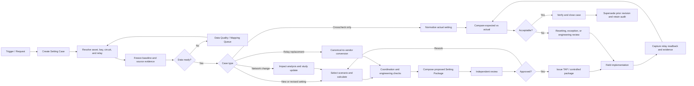

# PLMS Business Process Blueprint

Status: working blueprint v0.1
Purpose: remap PLMS around the protection-setting lifecycle before further UI or database implementation.

## 1. Product Boundary

PLMS manages the lifecycle, evidence, engineering context, and governance of protection settings.

PLMS is not intended to replace:

- PST or another enterprise asset register as the corporate asset source of truth.
- DIgSILENT/PowerFactory as the authoritative power-system simulation tool.
- Vendor engineering tools as the final validator for native relay setting files.
- NMM/CIM as an enterprise-wide network-model interchange standard.

PLMS still needs a protection-relevant network model. It stores or consumes the subset required to:

- identify the protected object and both ends of a circuit;
- identify local, remote, forward, and reverse bays;
- resolve line sections, transformers, busbars, and remote-bus branches;
- associate CT/VT, relay IED, firmware, and protection functions;
- select the correct network and fault-study snapshot;
- calculate, coordinate, compare, approve, issue, implement, and audit settings;
- determine which settings are affected by an engineering change.

The internal network graph is therefore a bounded PLMS domain model and working projection, not a replacement for the complete corporate network model.

## 2. Core Design Decision

The main business object should be a `Setting Case`, with one or more versioned `Setting Packages`.

```text
Setting Case
├── trigger and work scope
├── protected asset / bay / circuit
├── baseline evidence
├── network + technical-data snapshot
├── study scenario(s)
├── calculation run(s)
├── proposed Setting Package revision(s)
├── review and approval tasks
├── issued TAP / controlled outputs
├── field implementation and relay readback
├── verification and discrepancy resolution
└── closure and audit trail
```

This separates concepts that are currently mixed together:

- `Setting Case`: the business workflow and accountability container.
- `Study Scenario`: the electrical-system condition used for analysis.
- `Calculation Run`: one reproducible execution of a calculation method.
- `Setting Package`: the complete canonical setting intent for a protected object.
- `Setting Revision`: one controlled version of that package.
- `Source Document`: evidence, not automatically the current truth.
- `Actual Readback`: the observed setting in the installed relay.

## 3. End-to-End Business Process



### 3.1 Triggers

A Setting Case can be created from:

- a new bay, new substation, or energization project;
- topology change, line cut-in, reconductoring, or transformer change;
- relay, CT, or VT replacement;
- a planned setting revision;
- protection misoperation or disturbance follow-up;
- periodic crosscheck or compliance audit;
- mismatch between TAP, database, and installed relay;
- migration from one relay family/vendor to another;
- correction of incomplete or conflicting master data.

### 3.2 Data Readiness Gate

Calculation and approval must not proceed silently when required context is missing.

Readiness is evaluated by function and case type, for example:

- asset identity and bay lawan;
- topology and physical section;
- voltage level and system base;
- conductor/cable and sequence impedance;
- CT/VT ratio, location, polarity, and required class data;
- relay model, firmware, function availability, and vendor limits;
- current issued TAP and actual installed/readback setting;
- network revision and study scenario;
- maximum/minimum fault level and source contribution where required;
- required policy/reference documents;
- evidence date, source, confidence, and reviewer status.

Missing data creates a governed task. It must not be replaced by an undocumented default.

## 4. Supported Process Variants

### P1 — Actual Setting Crosscheck

Purpose: determine whether the installed relay matches the setting that should currently apply.

1. Select asset, bay, circuit, and installed relay.
2. Resolve the applicable issued Setting Revision.
3. Import actual setting from relay export, PDF, CSV, or manual entry.
4. Normalize vendor parameters into canonical parameters.
5. Compare values, logic, enablement, curve, timer, and relevant dependencies.
6. Classify mismatch as cosmetic, tolerance, functional, unsupported, or unknown.
7. Accept, create resetting work, or escalate to engineering review.
8. Store evidence and close the verification cycle.

### P2 — New or Revised Engineering Setting

Purpose: calculate and issue a new controlled setting revision.

1. Create case and freeze the current baseline.
2. Select network revision and approved study scenario.
3. Validate technical-data readiness.
4. Execute calculation template/rule set.
5. Run sensitivity, selectivity, reach, loadability, and coordination checks.
6. Apply documented engineering policy and explicit overrides.
7. Create a proposed canonical Setting Revision.
8. Perform independent review and approval.
9. Issue TAP and implementation package.
10. Capture field implementation and actual readback.
11. Verify and supersede the prior revision.

### P3 — Relay Replacement / Multi-vendor Conversion

Purpose: preserve protection intent while changing relay platform.

1. Resolve the approved canonical intent of the source setting.
2. Resolve source and target relay capability profiles.
3. Map equivalent functions, characteristics, logic, units, and dependencies.
4. Classify every parameter as exact, transformed, approximate, unsupported, or manual-design-required.
5. Recalculate values affected by different vendor implementation or hardware.
6. Run engineering and coordination checks.
7. Produce a proposed target-vendor Setting Revision and capability-gap report.
8. Review, approve, issue, implement, and read back using the normal lifecycle.

This is not a blind parameter-to-parameter conversion. Unsupported semantics must remain visible.

### P4 — Network / Engineering Data Change

Purpose: maintain protection context and identify affected settings.

1. Intake an approved project or network-change source.
2. Create an immutable Engineering Change Set.
3. Compare previous and proposed topology/technical data.
4. Validate identity, connectivity, impedance, CT/VT, and relay changes.
5. Identify affected bays, setting packages, studies, and issued revisions.
6. Export or stage the relevant delta for DIgSILENT/engineering-data update.
7. Import the resulting approved network/fault-study snapshot.
8. Open setting cases for every affected protection scope.
9. Activate the new network revision only through controlled approval.

### P5 — Master Data Correction

Purpose: correct identity or mapping without falsely presenting it as a physical network project.

1. Submit a correction with source evidence.
2. Review duplicates, aliases, bay lawan, equipment identity, and effective dates.
3. Assess downstream impact.
4. Approve and activate the correction.
5. Re-evaluate affected open cases and comparisons.

## 5. Lifecycle States

Different objects require separate state machines. Reusing one generic status for every object will create ambiguity.

### 5.1 Setting Case

```text
draft
→ data_preparation
→ engineering
→ internal_review
→ approval
→ issued
→ field_implementation
→ verification
→ closed
```

Alternate terminal states: `cancelled`, `rejected`, `on_hold`.

### 5.2 Setting Revision

```text
working
→ calculated
→ proposed
→ reviewed
→ approved
→ issued
→ implemented
→ verified
→ superseded
```

`as_found` is an observation/readback, not a replacement for `issued`. PLMS must retain both.

### 5.3 Source Document / Imported Dataset

```text
staged
→ extracted
→ mapped
→ reviewed
→ accepted
→ superseded
```

Alternate states: `extract_failed`, `rejected`, `duplicate`.

### 5.4 Master / Technical Data Revision

```text
draft
→ proposed
→ validated
→ approved
→ active
→ superseded
```

## 6. Data Domains and Ownership

| Data domain | Main entities | Preferred source of truth | PLMS responsibility |
|---|---|---|---|
| Organization and access | unit, UPT, ULTG, team, user, role, scope | corporate identity / PLMS administration | authorization, assignment, segregation of duties |
| Asset identity | substation, voltage level, busbar, bay, equipment | PST/asset register when available | map protection objects and retain snapshots |
| Protection topology | terminal, line section, transformer branch, bay lawan | approved engineering model / project documents | protection-relevant working projection and change impact |
| Electrical technical data | conductor, length, R/X/B sequence, transformer impedance | engineering-data owner / DIgSILENT input | version, validate, and bind to calculations |
| Study results | fault level, source contribution, scenario, network revision | DIgSILENT/PowerFactory study | immutable scenario snapshot and provenance |
| Instrument transformers | CT/VT specification and installation | asset/commissioning source | conversion basis and readiness checks |
| Relay asset | make, model, serial, firmware, installed location | asset/field record | bind actual device to protection functions |
| Relay capability library | functions, ranges, curves, semantics, vendor mapping | vendor manuals + reviewed PLMS library | canonical mapping and conversion constraints |
| Setting intent | protection scheme, canonical parameters, policy override | PLMS Setting Package | controlled engineering source of truth |
| Issued setting | TAP, approved revision, implementation instruction | PLMS or controlled document system | issue, version, distribute, and supersede |
| Actual setting | relay readback/export and checking evidence | installed relay observation | normalize, compare, and retain evidence |
| Source evidence | PDF, Excel, XMCD, SLD, `.set`, CSV | originating repository/system | checksum, extraction, mapping, and traceability |

## 7. Principal Data Entities

### 7.1 Identity and Asset

- `OrganizationUnit`
- `Substation`
- `VoltageLevel`
- `Busbar`
- `Bay`
- `Terminal`
- `ProtectedEquipment`
- `LineSection`
- `Transformer`
- `ConductorOrCable`
- `InstrumentTransformer`
- `RelayIED`
- `RelayFirmware`
- `ProtectionScheme`

Every physical and logical entity needs stable identity plus effective dating. Names and aliases are attributes, not primary identity.

### 7.2 Engineering Context

- `NetworkRevision`
- `TechnicalDataRevision`
- `EngineeringChangeSet`
- `StudyScenario`
- `FaultStudySnapshot`
- `FaultResult`
- `SourceContribution`
- `CalculationMethod`
- `CalculationRun`
- `CoordinationCheck`
- `EngineeringOverride`

### 7.3 Setting Lifecycle

- `SettingCase`
- `SettingPackage`
- `SettingRevision`
- `ProtectionFunctionSetting`
- `CanonicalParameterValue`
- `VendorParameterValue`
- `ConversionAssessment`
- `VerificationRun`
- `VerificationDifference`
- `FieldImplementation`
- `ActualReadback`
- `ApprovalTask`
- `IssuedArtifact`
- `AuditEvent`

### 7.4 Evidence and Data Quality

- `SourceDocument`
- `SourceDataset`
- `ExtractionRun`
- `MappingCandidate`
- `MappingDecision`
- `DataQualityIssue`
- `EvidenceLink`

## 8. Data Transactions

All material writes should create an audit event and preserve the prior version.

| Transaction | Reads | Writes | Typical actor | Required controls |
|---|---|---|---|---|
| Stage source document | file metadata | SourceDocument | Data Steward / Engineer | checksum, classification, access scope |
| Extract document | SourceDocument | ExtractionRun, candidates | System | parser version, confidence, raw evidence |
| Confirm mapping | candidates, asset graph | MappingDecision, links | Data Steward / Engineer | human review for ambiguous identity |
| Propose master change | source evidence, current revision | draft master revision | Data Steward | reason, effective date, impact preview |
| Approve master change | draft revision, impact | active revision | Master Data Approver | independent approval |
| Create setting case | trigger, asset scope | SettingCase | Engineer / Supervisor | ownership and organizational scope |
| Freeze baseline | active revisions, issued setting, actual | baseline snapshot | Engineer | immutable identifiers and timestamps |
| Select study scenario | network/fault snapshots | case scenario binding | Protection Engineer | compatible revision and approved status |
| Execute calculation | baseline, method, inputs | CalculationRun | Protection Engineer | unit validation, formula version, reproducibility |
| Apply engineering override | calculation result, policy | override record | Protection Engineer | justification and reviewer visibility |
| Compose setting revision | canonical results | proposed SettingRevision | Protection Engineer | completeness and capability checks |
| Convert vendor setting | canonical revision, capability profile | vendor proposal, gap report | Protection Engineer | no silent approximation |
| Submit review | proposed revision | ApprovalTask | Protection Engineer | revision frozen during review |
| Review setting | revision, checks, evidence | review decision | Protection Reviewer | cannot alter submitted values silently |
| Approve / reject | reviewed revision | approval decision | Authorized Approver | segregation of duties |
| Issue setting | approved revision | issued revision, TAP artifact | Issuer / Approver | document number, effective date, distribution |
| Record implementation | issued revision, work evidence | FieldImplementation | Field / Commissioning | device identity and timestamp |
| Import actual readback | relay export or record | ActualReadback | Field / Engineer | source hash and parser version |
| Verify actual | issued + actual | VerificationRun, differences | Engineer / Reviewer | tolerance profile and disposition |
| Resolve discrepancy | difference, evidence | resetting task or exception | Supervisor / Engineer | risk classification and due date |
| Close setting case | verified outcome | closed case | Case Owner / Approver | required evidence complete |
| Supersede revision | newly verified revision | prior revision state | System after approval | retain full history |

## 9. Roles and Access

Initial roles should be separated by responsibility and organizational scope. A role alone is insufficient; access also needs an assigned ULTG/UPT/UIT or project scope.

### 9.1 Proposed Roles

- `Viewer`: read authorized records and reports.
- `Field Technician`: upload actual readback and implementation evidence.
- `Data Steward`: intake sources, resolve mappings, and propose master-data changes.
- `Protection Engineer`: create cases, calculate, compare, and propose settings.
- `Protection Reviewer`: independently review calculations and proposed revisions.
- `Approver / Asisten Manajer`: approve or reject controlled setting revisions.
- `Issuer / Document Controller`: issue TAP and controlled artifacts after approval.
- `Manager`: portfolio oversight, exception acceptance, and escalations.
- `Auditor`: read-only access to all evidence and history in assigned scope.
- `System Administrator`: user, role, configuration, and integration administration; no implicit engineering approval.
- `Integration Service`: limited machine identity for approved import/export interfaces.

### 9.2 Access Matrix

Legend: `R` read, `C` create/execute, `U` update, `A` approve, `I` issue.

| Capability | Field | Data Steward | Engineer | Reviewer | Approver | Issuer | Manager | Auditor | Admin |
|---|---:|---:|---:|---:|---:|---:|---:|---:|---:|
| View authorized asset/setting data | R | R | R | R | R | R | R | R | R |
| Intake documents | C | C/U | C | R | R | C | R | R | config |
| Confirm mappings |  | C/U | C/U | R |  |  | R | R | config |
| Propose master-data revision |  | C/U | C | R |  |  | R | R | config |
| Approve master-data revision |  |  |  | A | A |  | A | R |  |
| Create/manage Setting Case |  |  | C/U | R | R | R | R | R | config |
| Execute calculation/conversion |  |  | C/U | R | R |  | R | R |  |
| Submit proposed revision |  |  | C | R | R |  | R | R |  |
| Independent engineering review |  |  |  | C/U | R |  | R | R |  |
| Approve/reject setting |  |  |  |  | A |  | A | R |  |
| Issue controlled TAP/package |  |  |  |  | R | I | R | R | config |
| Record field implementation | C/U |  | C/U | R | R | R | R | R |  |
| Verify actual setting | C |  | C/U | C/U | R |  | R | R |  |
| Accept material exception |  |  | propose | recommend | A |  | A | R |  |
| Manage users/roles/integrations |  |  |  |  |  |  | R | R | C/U |

Policy constraints:

- The creator should not approve the same Setting Revision.
- Review and approval decisions must reference an immutable revision.
- Admin privilege must not imply engineering authority.
- Field users should not change issued settings or master technical data.
- Cross-unit visibility and approval must follow assigned organizational scope.
- Emergency access, if introduced, must be time-limited and fully audited.

## 10. Assessment of Existing PLMS Modules

| Existing module | Relevance | Decision | Target position |
|---|---|---|---|
| Data Teknis / Master Data | Core | Keep and reshape | versioned Asset & Technical Data domain |
| Dokumen Sumber | Core | Keep and expand | evidence repository, extraction, provenance |
| Reference Setting | Partially core | Reshape | baseline resolution inside a Setting Case; no single universal “reference” |
| Actual Verification | Core | Keep and integrate | P1 crosscheck workflow and post-implementation verification |
| Vendor Import | Core capability | Move into workflow | document/readback intake; parser is a service, not a separate business silo |
| Calculation POC | Core, limited coverage | Keep and harden | Calculation Run inside P2/P3 Setting Case |
| Setting Register | Core | Promote | Setting Package history and effective-setting register |
| Mapping Inbox | Supporting core | Keep and rename | Data Quality & Mapping Work Queue |
| Audit Trail | Mandatory | Keep, distribute | per-case/per-entity history plus global audit search |
| Network Builder | Relevant with strict boundary | Keep and reframe | protection-topology workbench and Engineering Change Set editor |
| Working Network | Relevant context | Keep | read-only protection-context viewer and impact visualization |
| Study Dashboard / Bay List | Conceptually mixed | Replace/reshape | Setting Case work queue; technical Study becomes a sub-process |
| Coverage Check | Relevant validation | Integrate | check result attached to Calculation Run/Setting Revision |
| Verified Report | Relevant output | Integrate | generated artifact from verification/case closure |
| Legacy Home | Not suitable | Replace | role-based work queue, exceptions, and portfolio dashboard |
| NMM generator terminology/code | Not a product dependency | Park compatibility code | future adapter only if enterprise NMM integration becomes real |

## 11. Specific Answer: Are Network Builder and Study Still Relevant?

### Network Builder

Yes, but only for the protection-relevant topology needed by PLMS.

It is required for:

- bay-lawan determination;
- local/remote and forward/reverse context;
- multi-section lines and inserted substations;
- distance Z2/Z3 reach paths;
- transformer branches behind a remote bus;
- topology-change impact analysis;
- binding technical data, relay assets, and setting packages to the correct physical scope.

It should not attempt to reproduce every DIgSILENT object, load-flow model, switching state, or CIM/CGMES exchange feature.

In a future integrated environment:

- PST/asset systems provide identity and equipment hierarchy.
- DIgSILENT/PowerFactory provides approved electrical-model and study snapshots.
- PLMS consumes and reconciles those sources.
- Network Builder becomes a controlled correction/change-proposal workbench, not an independent source of enterprise truth.

### Study

Yes, and it is central to engineering calculation, but the current top-level `Study` concept is too broad.

The target model should be:

```text
Setting Case
└── one or more Study Scenarios
    └── one or more Calculation Runs
        └── checks and proposed Setting Revision
```

Crosscheck-only work may not need a new electrical study. It still needs a Setting Case, an applicable issued revision, and an actual readback.

A relay replacement may reuse an approved scenario but require a new conversion and calculation run.

A topology change must create a new network revision and normally a new approved study snapshot before final setting approval.

## 12. Proposed Information Architecture

The final navigation should follow work, not implementation components.

```text
My Work
├── Assigned Cases
├── Reviews & Approvals
├── Field Verification
└── Exceptions

Setting Management
├── Setting Cases
├── Effective Setting Register
└── Setting Package History

Engineering
├── Calculations & Studies
├── Coordination / Coverage
├── Multi-vendor Conversion
└── Engineering Changes

Data Management
├── Assets & Protection Topology
├── Technical Data & Study Snapshots
├── Relay Capability Library
├── Source Documents
└── Data Quality Queue

Governance
├── Issued Documents
├── Audit Search
├── Reports
└── Administration
```

Menus must be filtered by role. Users should land on assigned work rather than seeing every technical component.

## 13. Recommended MVP Remap

### Foundation F1 — Domain and Governance

- canonical entity identities and effective dating;
- Setting Case, Setting Package, and Setting Revision schema;
- separate lifecycle state machines;
- organization scope, roles, and segregation of duties;
- evidence and audit contract.

### Operational MVP O1 — Actual Crosscheck

- select bay and applicable issued revision;
- import/manual/PDF/CSV actual setting;
- canonical normalization and comparison;
- discrepancy disposition and evidence;
- verification report and case closure.

### Data MVP D1 — Controlled Data Intake

- source document registry;
- extraction and mapping queue;
- protection-relevant asset/topology registry;
- CT/VT and relay identity;
- provenance and data-quality status.

### Engineering MVP E1 — Calculation and Issuance Pilot

- one validated P545 case with Mathcad parity;
- immutable scenario and calculation run;
- canonical proposed revision;
- review, approval, issue, and TAP draft;
- field readback returning to O1.

### Conversion MVP C1 — Multi-vendor Pilot

- capability profiles for selected MiCOM, Siemens, and ABB/Hitachi families;
- semantic mapping and gap classification;
- proposed target-vendor setting package;
- no native vendor writer until official-tool validation is available.

### Change MVP N1 — Network and Engineering Change

- topology/equipment change set;
- affected-setting impact analysis;
- DIgSILENT/engineering-data staging;
- approved snapshot re-import;
- automatic creation of affected Setting Cases.

## 14. Decisions Still Requiring Business Confirmation

The following should be confirmed with process owners before database implementation:

1. Organizational approval chain for each case type and voltage level.
2. Whether the official issued TAP remains in an existing document system or is issued directly by PLMS.
3. Which system owns asset identity, relay serial/firmware, and CT/VT master data.
4. Who can declare a network/fault-study snapshot approved for setting calculation.
5. Rules for emergency setting changes and retrospective approval.
6. Which mismatch classes require immediate resetting, engineering review, or accepted exception.
7. Required evidence for field implementation and verification.
8. Setting-package granularity: per relay, per bay, per circuit end, or coordinated multi-end package.
9. Cross-UPT/UIT visibility and approval for lines whose two ends have different ownership.
10. Record-retention, document-numbering, and electronic-signature requirements.

These decisions affect authorization and data transactions materially and should not be guessed from the current UI.
